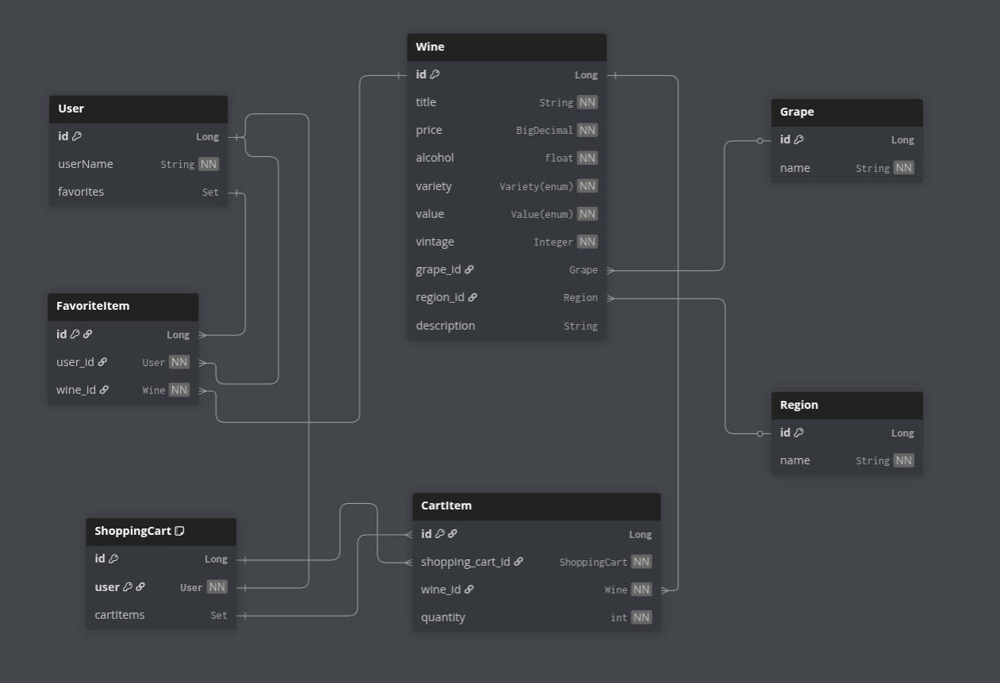

# Bloom 🍷

**Bloom** is a wine shop application where users can explore wines, search dynamically, add favorites,
and add items to the shopping cart for future orders through a simple REST API.

---

### Table of contents

[Key Technologies](#key-technologies)

[Architecture Overview](#architecture-overview)

[List of Controllers](#list-of-controllers)

[Database Schema Relationship Diagram](#database-schema-relationship-diagram)

[Fork and Clone a Project on GitHub](#fork-and-clone-a-project-on-gitHub)

[How to Launch a Spring Boot Application with Maven or Docker Compose](#how-to-launch-a-spring-boot-application-with-maven-or-docker-compose)

[All Postman collections](#all-postman-collections)

---

### Key Technologies

+ Java 17 – Primary programming language used for backend development.

+ Maven – Dependency and build management tool for Java projects.

+ Spring Boot 3.3.2 – Enables rapid application development with embedded server support and 
+ production-ready configurations.

+ Spring Security 6.3.1 – Handles authentication and authorization with integrated JWT support.

+ Spring Data JPA 3.3.2 (Hibernate 6.5.2.Final) – Simplifies database operations with powerful 
+ object-relational mapping.

+ MapStruct 1.5.5.Final – Efficient DTO-to-entity and entity-to-DTO mapping.

+ Liquibase 4.23.0 – Manages database schema changes with version control and automated tracking.

+ PostgreSQL 42.6.0 (JDBC Driver) – Reliable relational database used for persistent data storage.

+ Lombok 1.18.38 – Reduces boilerplate code through annotations.

+ Swagger (OpenAPI) – Provides interactive and automatically generated API documentation.

+ Postman – Used for API testing, validation, and development workflows.

+ Docker – Ensures consistent deployment across environments via containerization.

---

### Architecture Overview

This project follows a Layered Architecture, designed to ensure a clear separation of concerns while 
improving maintainability, scalability, and testability. Each layer has a distinct role in the system, 
enabling modular development and easier evolution over time.

**Controller Layer**

- Exposes RESTful API endpoints.

- Handles HTTP requests and responses.

- Delegates business logic execution to the Service Layer.

**Service Layer**

- Contains core business logic.

- Ensures data validation and enforces business rules.

- Coordinates interactions between repositories, mappers, security.

**Repository Layer**

- Manages data persistence using Spring Data JPA (Hibernate).

- Interacts with the PostgreSQL database for reliable storage and retrieval.

- Supports custom JPQL/SQL queries for complex access logic.

**Model Layer**

- Defines domain entities mapped to PostgreSQL tables.

- Provides DTOs (Data Transfer Objects) for secure and efficient communication between layers.

**Mapper Layer**

- Uses MapStruct to automatically map between entities and DTOs.

- Keeps the Service and Controller layers clean from repetitive transformation logic.

**Security Layer**

- Implements user self-registration with JWT token generation.

---

### List of Controllers
The Bloom Service is built on a RESTful architecture, providing a modular and scalable backend foundation.
The system exposes multiple API endpoints organized into dedicated controller modules, each responsible for 
a specific domain of functionality.

**AuthenticationController**

- **POST:** `/auth/registration` - Auto register new users.

**WineController**

- **GET:** `/wines` - View a list of all wines.
- **GET:** `/wines/{wineId}` - View wine details by id.
- **GET:** `/wines/search` - View a list of all wines filtered by parameters.

**ShoppingCartController**

- **POST:** `/cart` - Add the item to the shopping cart.
- **GET:** `/cart` - View a list of all items in the shopping cart.
- **PUT:** `/cart/items/{itemId}` - Change item quantity in the shopping cart.
- **DELETE:** `/cart/{itemId}` - Delete the item in the shopping cart.

**FavoriteItemController**

- **POST:** `/favorites/add` - Add a user's favorite item.
- **GET:** `/favorites/all` - View a list of all user's favorite items.
- **DELETE:** `/favorites/{favoriteItemId}` - Delete the user's favorite item

---

### Database Schema Relationship Diagram



---
###  Fork and Clone a Project on GitHub

Forking creates a personal copy of someone else's repository under your GitHub account.

- [Go to the GitHub page of the repository you want to fork](https://github.com/team-project-bloom/bloom)
- Click the "Fork" button in the upper-right corner
- Select your GitHub account (or organization) to create the fork

  You now have your own copy of the project.

Make sure you have Git installed on your machine

- You can check by running:
```
git --version
```

Cloning downloads your forked project to your local machine so you can run or work on it.

- On your forked repository page (on your GitHub account), click the "Code" button
- Copy the URL under HTTPS or SSH
- Open a terminal (or Git Bash) on your computer
- Run the following command
```
git clone https://github.com/team-project-bloom/bloom.git
```

---

### How to Launch a Spring Boot Application with Maven or Docker Compose

Before running the application, ensure the following tools are installed and available:

- Java (17 or compatible)
```
java -version
```

- Maven (3.8+ recommended)
```
mvn -version
```

- Docker & Docker Compose
```
docker --version
docker compose version
```
Open the Terminal
- Open a terminal or command prompt on your computer

Navigate to the Project Folder
- Use the cd command to move into the folder that contains your Spring Boot project (the folder with the pom.xml file):
```
cd path/to/your/project
```
*Example:*
```
cd ~/Documents/bloom
```

Before running the project, create .env a file in the root directory with the required credentials

*Example:*
```

POSTGRES_DATABASE=your_data      //bloom
POSTGRES_USER=your_data          //root
POSTGRES_PASSWORD=your_data      //root
POSTGRES_LOCAL_PORT=your_data    //5433
POSTGRES_DOCKER_PORT=your_data   //5432
SPRING_LOCAL_PORT=your_data      //8081
SPRING_DOCKER_PORT=your_data     //8080
JWT_SECRET=your_data             //2q2w3e4r5t6y7u8i9o0pqawsedrftgyhujikolpazsxdcfvgbhnjmklqwertyuiop
DEBUG_PORT=your_data             //5005
```

Run the Application Using Maven
- Use the following command to launch the Spring Boot application:
```
mvn spring-boot:run
```

**Or Use Docker Compose to run app**

- Create .jar file
```
mvn clean package
```

- Run the app with Docker Compose
```
docker compose up --build
```

Verify the Application is Running
- If successful, you will see logs ending with something like:
```
Started BloomApplication in X.XXX seconds (process running for X.XXX)
```

Now that Spring Boot application is running, you can use Postman (or any other REST client) to test its API endpoints.

---

**You can also test this API yourself using Swagger by accessing the following link:**

```
http://localhost:<SPRING_LOCAL_PORT>/api/swagger-ui/index.html
```

---

### All Postman collections

[Postman collections](bloom.postman_collection.json)

---
